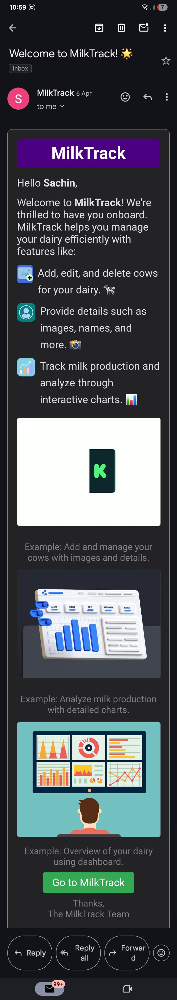
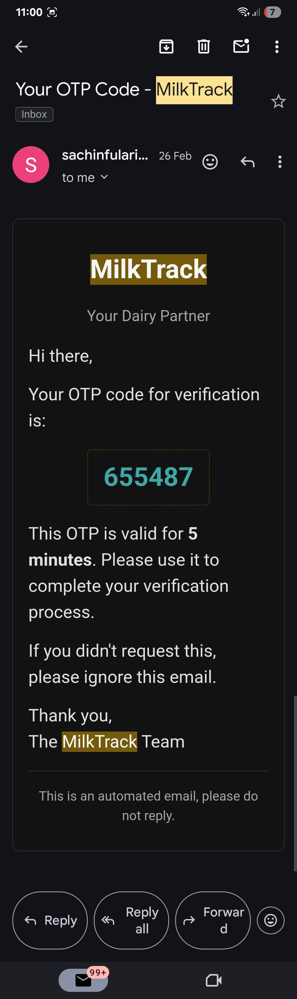

**MilkTrack** is a modern web-based solution tailored for dairy farmers to streamline milk production tracking, cow health monitoring, and performance analytics. Built with scalability and ease of use in mind, it empowers both rural and commercial farms to manage data efficiently and make smarter decisions.

---

## 🌟 Key Features

- 📅 Track Daily, Weekly & Monthly Milk Records  
- 🐮 Individual Cow Data with Review and Goal System  
- 📊 Visual Charts for Production Insights  
- 🔐 Authentication 
- 📅 Real-Time Send Email OTP and Welcome
- 📥 Download Reports in PDF 
- 📅 Automatic Contact Form-Fill UP

---

## 🖼️ Demo Screenshots
---
Home page

  
---

Footer Section
  
---

About Page
  
---

Contact Form
  
---

SignUP
  
---

Login
  
---

Shimmer Smooth UI 
  
---

Add Cow Page
  
---

Verify To See Cow
 
--- 

OTP Functionality
  
---

Edit Cow
  
---

Delete Cow
  
---

  
---

Add Data
 
--- 

Production Visualization in Charts
  
---

Highest VS Lowest Production in week 
 
--- 

Review And Goal (for Future)

--- 
 

Welcome Email After Signup 
  
---

OTP

---

---

## 🧰 Tech Stack

**Frontend:**
- React.js 
- Tailwind CSS
- Chart.js
- Axios

**Backend:**
- Node.js + Express.js
- MongoDB + Mongoose
- JWT Authentication
- Multer (for uploads)
